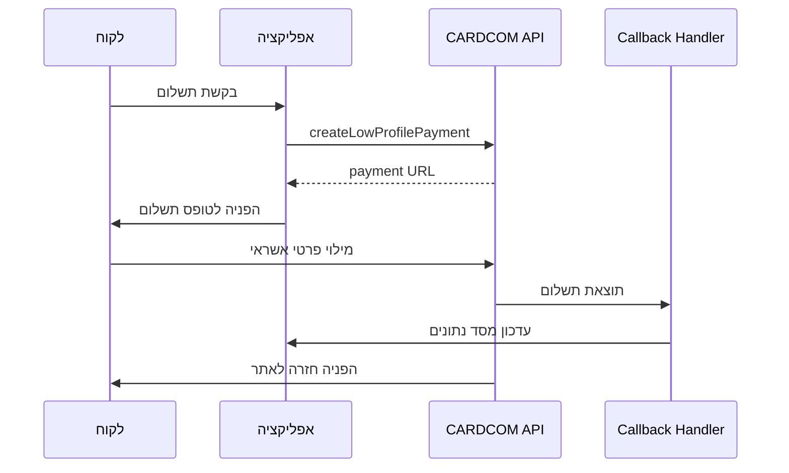

# מדריך יישום CARDCOM - MASU Platform 2024

## סטטוס המערכת ✅

המערכת **פעילה ותקינה** עם CARDCOM API v11. כל בעיות ה-404 שטופלו והמערכת עובדת במצבי TEST ו-PRODUCTION.

## הגדרות סביבה נדרשות

### משתני סביבה (.env.local / .env.production)
```bash
# פרטי חיבור CARDCOM (לא לשתף!)
CARDCOM_TERMINAL=your_terminal_number
CARDCOM_API_TOKEN=your_api_token
CARDCOM_BASE_URL=https://secure.cardcom.solutions/api/v11

# בקרת מצב התשלומים
CARDCOM_TEST_MODE=true  # true = בדיקה, false = ייצור

# URLs של האפליקציה  
NEXT_PUBLIC_APP_URL=https://your-domain.com
```

### וידוא הגדרות בפרודקשן
```typescript
// בדיקת הגדרות בפעילות המערכת
const status = cardcomService.getStatus()
console.log(status) // => { configured: true, testMode: false, ... }
```

## ארכיטקטורת התשלומים

### זרימת עבודה עיקרית


## API Routes הפעילים

### 1. יצירת תשלום - /api/payments/create
```typescript
// POST /api/payments/create
{
  "type": "booking" | "subscription" | "gift_voucher",
  "bookingId": "unique_booking_id", 
  "amount": 150.50,
  "description": "תיאור התשלום בעברית",
  "customerName": "שם הלקוח",
  "customerEmail": "email@example.com",
  "customerPhone": "050-1234567"
}

// Response
{
  "success": true,
  "paymentId": "generated_payment_id",
  "redirectUrl": "https://secure.cardcom.solutions/pay/..."
}
```

### 2. Callback Handler - /api/payments/callback  
```typescript
// מקבל נתונים מ-CARDCOM אחרי התשלום
// עיבוד אוטומטי של תוצאות התשלום
// עדכון סטטוס הזמנה במסד הנתונים
// יצירת טוקן למשתמש (אם הצליח)
```

### 3. חיוב ישיר - /api/payments/direct-charge
```typescript
// POST /api/payments/direct-charge
{
  "token": "customer_saved_token",
  "amount": 120.00,
  "description": "חיוב מנוי חודשי",
  "paymentId": "unique_payment_id"
}
```

### 4. החזר - /api/payments/refund
```typescript  
// POST /api/payments/refund
{
  "originalPaymentId": "payment_to_refund",
  "amount": 50.00, // סכום להחזר (חלקי או מלא)
  "reason": "סיבת ההחזר"
}
```

## השירות CardcomService - תיעוד מפורט

### מתודות זמינות

#### createLowProfilePayment()
```typescript
const result = await cardcomService.createLowProfilePayment({
  amount: 150.50,                    // סכום בשקלים
  description: "הזמנת טיפול ספא",     // תיאור בעברית
  paymentId: "booking_12345",        // מזהה ייחודי שלך
  customerName: "דני כהן",           // שם הלקוח
  customerEmail: "danny@example.com", // אימייל
  customerPhone: "050-1234567",      // טלפון (אופציונלי)
  successUrl: "https://...",         // URL הצלחה (אופציונלי)
  errorUrl: "https://..."            // URL שגיאה (אופציונלי)
})

// תוצאה מוצלחת
if (result.success) {
  window.location.href = result.data.url  // הפניה לתשלום
}
```

#### chargeToken() - חיוב עם טוקן קיים
```typescript
const result = await cardcomService.chargeToken({
  amount: 120.00,
  description: "חיוב מנוי",
  token: "TKN_abc123...",      // טוקן שמור מתשלום קודם
  paymentId: "sub_67890",
  createNewToken: false        // האם ליצור טוקן חדש
})
```

#### refund() - החזר כספי
```typescript
const result = await cardcomService.refund({
  amount: 75.00,               // סכום להחזר
  description: "החזר חלקי",
  token: "TKN_abc123...",      // טוקן המקורי
  paymentId: "refund_98765"
})
```

#### כלי עזר ובדיקות
```typescript
// בדיקת סטטוס המערכת
const status = cardcomService.getStatus()
// => { configured: true, testMode: false, terminal: "125***" }

// בדיקת חיבור ל-CARDCOM
const connection = await cardcomService.testConnection()
// => { success: true } או { success: false, error: "..." }

// מעבר זמני למצב בדיקה (לדיבוג)
cardcomService.setTestMode(true)

// עיבוד callback data מ-CARDCOM
const result = cardcomService.processCallback(callbackData)
```

## מצבי פעילות

### מצב בדיקה (TEST MODE)
```bash
CARDCOM_TEST_MODE=true
```

**מה קורה במצב בדיקה:**
- ✅ תשלומים מדומים (ללא חיוב אמיתי)
- ✅ טוקנים מדומים בפורמט `TOK_xxx`
- ✅ לוגים מפורטים בקונסול
- ✅ תגובות קבועות ומוצלחות
- ✅ מהיר לפיתוח ובדיקות

### מצב ייצור (PRODUCTION MODE)
```bash
CARDCOM_TEST_MODE=false
```

**מה קורה במצב ייצור:**
- 💰 תשלומים אמיתיים עם חיוב כספי
- 🔐 טוקנים אמיתיים מוצפנים
- 📊 לוגים מינימלים (ללא נתונים רגישים)
- ⏱️ תלוי ברשת ובשרתי הבנקים
- 🎯 הפעלה לאקלנטים אמיתיים

### מעבר בין מצבים
**החוקה:** משנים רק את משתה הסביבה ומאתחלים את האפליקציה.

```bash
# מפיתוח לייצור
CARDCOM_TEST_MODE=false

# מייצור חזרה לפיתוח (לצורך דיבוג)
CARDCOM_TEST_MODE=true

# אתחול נדרש אחרי כל שינוי
pm2 restart app  # או restart container
```

## מבנה נתונים במסד הנתונים

### Payment Document Schema
```typescript
interface PaymentDocument {
  _id: string;                    // מזהה MongoDB
  order_id: string;               // קישור להזמנה
  booking_id?: string;            // קישור לבוקינג (אם רלוונטי)
  sum: number;                    // סכום התשלום
  pay_type: "ccard";              // תמיד כרטיס אשראי
  sub_type: "token" | "direct";   // טוקן או ישיר
  
  // נתוני הקלט המקוריים
  input_data: {
    bookingId?: string;
    amount: number;
    description: string;
    customerName: string;
    customerEmail: string;
    customerPhone?: string;
    type: "booking" | "subscription" | "gift_voucher";
    timestamp: string;
  };
  
  // נתוני התוצאה מ-CARDCOM
  result_data?: {
    status: "success" | "error";
    complete: "1" | "0";
    token: "1" | "0";
    sum: string;
    returnValue: string;
    internalDealNumber?: string;
    cardcomToken?: string;
    last4?: string;
    callbackTime: string;
  };
  
  transaction_id?: string;        // מזהה עסקה של CARDCOM
  complete: boolean;              // האם התשלום הושלם
  has_token: boolean;             // האם נוצר טוקן
  start_time: Date;              // תחילת התשלום
  end_time?: Date;               // סיום התשלום
}
```

### Customer Token Storage
```typescript
interface CustomerToken {
  _id: string;
  customerId: string;             // מזהה הלקוח
  paymentId: string;              // הפיימנט שיצר את הטוקן
  cardcomToken: string;           // הטוקן המוצפן
  last4: string;                  // 4 ספרות אחרונות
  active: boolean;                // האם הטוקן פעיל
  createdAt: Date;
  lastUsed?: Date;
}
```

## Callback Data Processing

### מבנה הנתונים המתקבלים מ-CARDCOM
```typescript
interface CardcomCallback {
  complete?: "1" | "0";           // הצלחה/כישלון
  token?: "1" | "0";              // האם נוצר טוקן
  sum?: string;                   // סכום התשלום
  currency?: string;              // מטבע (תמיד "1" לשקל)
  ReturnValue?: string;           // המזהה שלך
  InternalDealNumber?: string;    // מזהה עסקה של CARDCOM
  Last4?: string;                 // 4 ספרות אחרונות
  Token?: string;                 // הטוקן (אם נוצר)
}
```

### עיבוד ה-Callback
```typescript
export async function POST(request: Request) {
  try {
    const url = new URL(request.url)
    const callbackData = Object.fromEntries(url.searchParams)
    
    // עיבוד הנתונים
    const result = cardcomService.processCallback(callbackData)
    
    if (result.success) {
      // עדכון סטטוס ההזמנה
      await updatePaymentStatus(result.paymentId, 'completed', result)
      
      // שמירת טוקן (אם נוצר)
      if (result.token) {
        await saveCustomerToken(
          result.paymentId, 
          result.token, 
          result.last4
        )
      }
      
      // הפניה לעמוד הצלחה
      return redirect(`/payment-success?paymentId=${result.paymentId}`)
    } else {
      // הפניה לעמוד שגיאה
      return redirect(`/payment-error?paymentId=${result.paymentId}`)
    }
  } catch (error) {
    logger.error("Callback processing error", { error })
    return new Response("Error", { status: 500 })
  }
}
```

## מערכת לוגים וניטור

### רמות לוגינג
```typescript
// מידע כללי (תמיד)
logger.info("Payment initiated", { 
  paymentId, amount, testMode 
})

// אזהרות 
logger.warn("Payment callback delayed", { 
  paymentId, timeSinceStart 
})

// שגיאות
logger.error("CARDCOM API error", { 
  paymentId, responseCode, description 
})
```

### מה לא לתעד בלוגים
- ❌ מספרי כרטיסי אשראי
- ❌ CVV קודים  
- ❌ טוקנים מלאים (רק hash)
- ❌ פרטי API Key

### מה כן לתעד
- ✅ מזהי תשלום
- ✅ סכומים
- ✅ קודי תגובה של CARDCOM
- ✅ זמני תגובה
- ✅ מצב המערכת (TEST/PROD)

## טיפול בשגיאות

### קודי שגיאה של CARDCOM
```typescript
const CARDCOM_ERRORS = {
  "0": "הצלחה ✅",
  "1": "שגיאה כללית - בדוק פרמטרים",
  "2": "פרמטר חסר או שגוי",
  "3": "בעיה באימות - בדוק Terminal/API Key",
  "4": "טוקן לא תקף או פג תוקף",
  "5": "סכום לא תקף",
  "6": "מטבע לא נתמך", 
  "7": "תקלה בתקשורת עם הבנק",
  "8": "כרטיס אשראי לא תקף",
  "9": "אין מספיק כסף בכרטיס",
  "10": "כרטיס חסום",
  "11": "עסקה דחויה על ידי הבנק",
  "12": "תאריך תפוגה שגוי",
  "13": "CVV שגוי",
  "14": "שם בעל הכרטיס שגוי",
  "15": "מספר תעודת זהות שגוי"
}
```

### טיפול בשגיאות רשת
```typescript
try {
  const result = await cardcomService.createLowProfilePayment(params)
} catch (error) {
  if (error.message.includes('HTTP 404')) {
    // בעיה בכתובת endpoint
    logger.error("CARDCOM endpoint not found", { error })
  } else if (error.message.includes('timeout')) {
    // timeout
    logger.warn("CARDCOM request timeout", { error })
  } else {
    // שגיאה כללית
    logger.error("CARDCOM request failed", { error })
  }
}
```

## בדיקות לפני העלאה לייצור

### Checklist טכני
- [ ] `CARDCOM_TEST_MODE=false` בפרודקשן
- [ ] כל משתני הסביבה מוגדרים נכון
- [ ] `cardcomService.testConnection()` מחזיר success
- [ ] Callback URLs נגישים מהאינטרנט
- [ ] HTTPS פעיל ותקין
- [ ] מסד הנתונים מוכן לרשומות תשלום

### בדיקות פונקציונליות
- [ ] יצירת תשלום מחזירה URL תקין
- [ ] השלמת תשלום מעדכנת מסד נתונים
- [ ] יצירת טוקן עובדת
- [ ] חיוב עם טוקן קיים עובד
- [ ] החזר כספי עובד
- [ ] טיפול בשגיאות עובד

### בדיקת ביצועים
- [ ] זמן תגובה ממוצע < 3 שניות
- [ ] שיעור הצלחת תשלומים > 95%
- [ ] זמן callback < 30 שניות
- [ ] לוגים ללא נתונים רגישים

## אבטחה ו-Compliance

### עקרונות אבטחה מיושמים
- ✅ **Zero Credit Card Data**: אף פעם לא שומרים פרטי אשראי
- ✅ **HTTPS Everywhere**: כל התקשורת מוצפנת
- ✅ **Token-Based**: רק טוקנים מוצפנים נשמרים
- ✅ **Callback Validation**: ולידציה של נתוני CARDCOM
- ✅ **Environment Separation**: הפרדה בין TEST/PROD

### דרישות נוספות לפרודקשן
- 🔐 **WAF** (Web Application Firewall)
- 📋 **PCI DSS Compliance** (דרך CARDCOM)
- 🛡️ **DDoS Protection**
- 📊 **Transaction Monitoring**
- 🚨 **Fraud Detection**

## תחזוקה שוטפת

### ניטור יומי
```typescript
// בדיקת חיבור אוטומטית
const healthCheck = await cardcomService.testConnection()
if (!healthCheck.success) {
  alert.send("CARDCOM connection failed")
}

// סטטיסטיקות תשלומים
const stats = await getPaymentStats('last24hours')
// שיעור הצלחה, ממוצע זמנים, שגיאות נפוצות
```

### עדכונים תקופתיים
- 📅 **חודשי**: בדיקת version CARDCOM API
- 📅 **רבעוני**: ביקורת אבטחה
- 📅 **שנתי**: חידוש תעודות SSL

## פתרון בעיות נפוצות

### תשלום "תקוע" בסטטוס pending
```bash
# בדיקה במסד הנתונים
db.payments.find({ complete: false, start_time: { $lt: new Date(Date.now() - 3600000) } })

# אם נמצאו - בדיקה ידנית מול CARDCOM או סגירה
```

### שגיאות 404 מ-CARDCOM
```bash
# וידוא endpoints נכונים בקוד
grep -r "LowProfile\|Transaction" lib/services/cardcom-service.ts

# אם נמצאו - החלפה ל-"payments", "directPay", "directRefund"
```

### Callback לא מתקבל
```bash
# בדיקת נגישות callback URL
curl -X POST https://yourdomain.com/api/payments/callback -d "test=1"

# בדיקת לוגים של reverse proxy/CDN
```

---

## סיכום מהיר

המערכת **מוכנה לייצור** עם:
- ✅ CARDCOM API v11 מחובר ועובד
- ✅ מצבי TEST/PROD נשלטים רק על ידי ENV variable
- ✅ תשלומים דרך iframe מאובטח
- ✅ טוקנים לחיובים עתידיים
- ✅ החזרים כספיים
- ✅ לוגים מפורטים ואבטחה

**המעבר לייצור דורש רק:** `CARDCOM_TEST_MODE=false` + restart. 