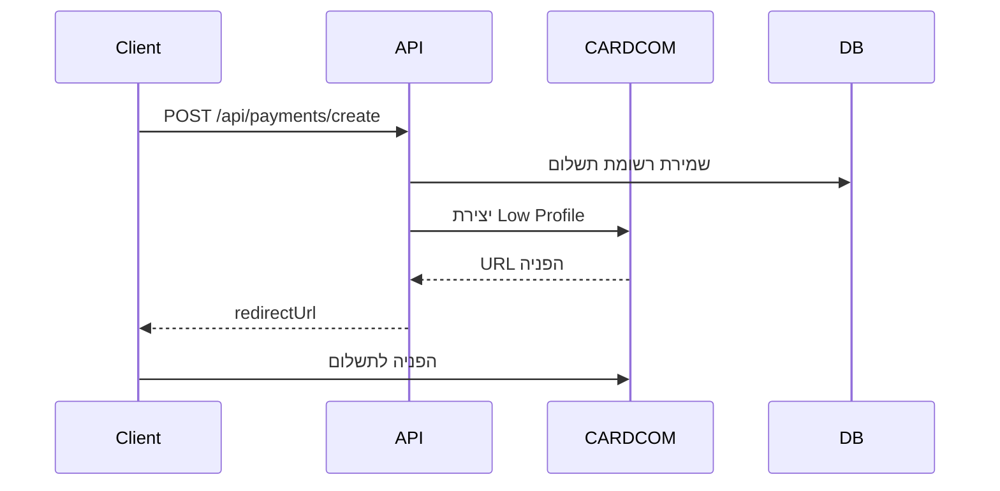
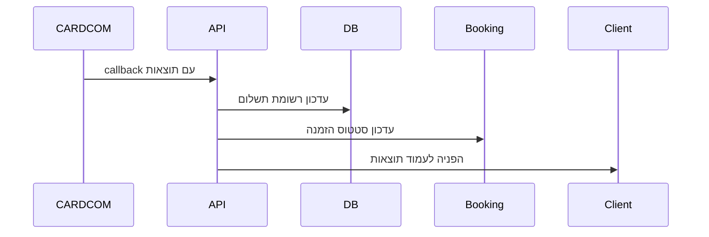

# מדריך יישום CARDCOM - MASU Platform

## סקירה כללית

המערכת משולבת עם שירות התשלומים CARDCOM לטיפול בתשלומי הזמנות, מנויים וגיפט קארדים.

## הגדרות חיבור

### פרטי החיבור
- **Terminal**: 125566
- **API Token**: Q3ZqTMTZGrSIKjktQrfN
- **Base URL**: https://secure.cardcom.solutions/api/v11

### משתני סביבה נדרשים

```env
# CARDCOM Configuration
CARDCOM_TERMINAL=125566
CARDCOM_API_TOKEN=Q3ZqTMTZGrSIKjktQrfN
CARDCOM_BASE_URL=https://secure.cardcom.solutions/api/v11
CARDCOM_TEST_MODE=true  # false לייצור

# Application URLs
NEXT_PUBLIC_BASE_URL=https://your-domain.com
```

## סוגי תשלום נתמכים

### 1. Low Profile (iframe) Payments
- תשלום דרך iframe של CARDCOM
- מתאים לתשלומים רגילים עם הפניה
- תמיכה ביצירת טוקנים לשימוש עתידי

### 2. Direct Token Charge
- חיוב ישיר עם טוקן קיים
- מתאים למנויים וחיובים חוזרים

### 3. Direct Card Charge
- חיוב ישיר עם פרטי כרטיס אשראי
- תמיכה ביצירת טוקן חדש

### 4. Refunds
- החזרים דרך טוקן

## API Endpoints

### יצירת תשלום
```typescript
POST /api/payments/create
{
  "bookingId": "booking_id",
  "amount": 150.00,
  "description": "הזמנת טיפול",
  "customerName": "שם הלקוח",
  "customerEmail": "email@example.com",
  "customerPhone": "050-1234567",
  "type": "booking" // או "subscription", "gift_voucher"
}
```

### ניהול הגדרות CARDCOM (מנהל בלבד)
```typescript
// קבלת הגדרות נוכחיות
GET /api/admin/payments/cardcom-config

// עדכון מצב TEST/PRODUCTION
POST /api/admin/payments/cardcom-config
{
  "testMode": false
}

// בדיקת חיבור
PUT /api/admin/payments/cardcom-config
```

## השירות CardcomService

### מתודות זמינות

#### createLowProfilePayment
```typescript
const result = await cardcomService.createLowProfilePayment({
  amount: 150.00,
  description: "הזמנת טיפול",
  paymentId: "unique_payment_id",
  customerName: "שם הלקוח",
  customerEmail: "email@example.com",
  customerPhone: "050-1234567",
  successUrl: "https://domain.com/payment/success",
  errorUrl: "https://domain.com/payment/error"
})
```

#### chargeToken
```typescript
const result = await cardcomService.chargeToken({
  amount: 150.00,
  description: "חיוב מנוי",
  token: "customer_token",
  paymentId: "unique_payment_id",
  createNewToken: true // אופציונלי
})
```

#### chargeCard
```typescript
const result = await cardcomService.chargeCard({
  amount: 150.00,
  description: "תשלום חדש",
  cardNumber: "4580123456789012",
  cvv: "123",
  expMonth: "12",
  expYear: "25",
  holderName: "שם בעל הכרטיס",
  holderId: "123456789", // אופציונלי
  paymentId: "unique_payment_id",
  createToken: true // אופציונלי
})
```

#### refund
```typescript
const result = await cardcomService.refund({
  amount: 150.00,
  description: "החזר",
  token: "customer_token",
  paymentId: "refund_payment_id"
})
```

#### כלים נוספים
```typescript
// בדיקת סטטוס
const status = cardcomService.getStatus()

// מעבר בין מצבים
cardcomService.setTestMode(true)

// בדיקת חיבור
const connectionTest = await cardcomService.testConnection()

// עיבוד callback
const callbackResult = cardcomService.processCallback(callbackData)
```

## תהליך התשלום

### 1. יצירת תשלום


### 2. השלמת תשלום


## מצב בדיקה (TEST MODE)

### הפעלה
```typescript
// דרך משתה סביבה
CARDCOM_TEST_MODE=true

// דרך השירות
cardcomService.setTestMode(true)

// דרך פאנל מנהל
POST /api/admin/payments/cardcom-config { "testMode": true }
```

### תכונות מצב בדיקה
- תשלומים מדומים (לא חיוב אמיתי)
- טוקנים מדומים
- לוגים מפורטים
- תגובות מדומות עקביות

### מעבר לייצור
1. עדכון `CARDCOM_TEST_MODE=false`
2. וידוא פרטי חיבור נכונים
3. בדיקת חיבור דרך הפאנל
4. בדיקת תשלום ראשון

## מודל הנתונים

### Payment Document
```typescript
{
  _id: "payment_id",
  order_id: "booking_id",
  booking_id: "booking_id",
  sum: 150.00,
  pay_type: "ccard",
  sub_type: "token",
  input_data: {
    bookingId: "booking_id",
    amount: 150.00,
    description: "הזמנת טיפול",
    customerName: "שם הלקוח",
    customerEmail: "email@example.com",
    customerPhone: "050-1234567",
    type: "booking",
    timestamp: "2024-01-01T12:00:00.000Z"
  },
  result_data: {
    status: "success",
    complete: "1",
    token: "1",
    sum: "150.00",
    returnValue: "payment_id",
    internalDealNumber: "CARDCOM_TXN_123",
    cardcomToken: "TOKEN_ABC123",
    last4: "1234",
    callbackTime: "2024-01-01T12:05:00.000Z"
  },
  transaction_id: "CARDCOM_TXN_123",
  complete: true,
  has_token: true,
  start_time: "2024-01-01T12:00:00.000Z",
  end_time: "2024-01-01T12:05:00.000Z"
}
```

## קודי שגיאה

```typescript
const CARDCOM_ERROR_CODES = {
  "0": "הצלחה",
  "1": "שגיאה כללית",
  "2": "פרמטר חסר או שגוי",
  "3": "בעיה באימות",
  "4": "טוקן לא תקף",
  "5": "סכום לא תקף",
  "6": "מטבע לא נתמך",
  "7": "תקלה בתקשורת עם הבנק",
  "8": "כרטיס אשראי לא תקף",
  "9": "אין מספיק כסף בכרטיס",
  "10": "כרטיס חסום",
  "11": "עסקה דחויה",
  "12": "תאריך תפוגה שגוי",
  "13": "CVV שגוי",
  "14": "שם בעל הכרטיס שגוי",
  "15": "מספר תעודת זהות שגוי"
}
```

## אבטחה

### הגנות מיושמות
- הצפנת טוקנים
- ולידציה של callbacks
- HTTPS חובה
- טיפול בשגיאות מובנה
- לוגים מפורטים

### בדיקות אבטחה
- [ ] וידוא HTTPS בייצור
- [ ] בדיקת ולידציה של נתונים
- [ ] בדיקת הגנה מפני CSRF
- [ ] בדיקת טיפול בשגיאות

## ניטור ולוגים

### לוגים זמינים
```typescript
// יצירת תשלום
logger.info("Creating CARDCOM Low Profile payment", {
  paymentId, amount, testMode, terminal
})

// תוצאות תשלום
logger.info("Payment callback received", {
  paymentId, complete, token, sum, transactionId
})

// שגיאות
logger.error("CARDCOM API Error", {
  code, description, errorMessage
})
```

### מדדי ביצועים
- זמן תגובה של API
- שיעור הצלחת תשלומים
- סוגי שגיאות נפוצים
- שימוש במצב בדיקה vs ייצור

## בדיקות לפני העלאה

### מצב בדיקה
- [ ] יצירת תשלום Low Profile
- [ ] השלמת תשלום מוצלח
- [ ] טיפול בתשלום נכשל
- [ ] חיוב עם טוקן
- [ ] יצירת החזר

### מצב ייצור
- [ ] בדיקת חיבור אמיתי
- [ ] תשלום בסכום קטן (1 ש"ח)
- [ ] וידוא קבלת callbacks
- [ ] בדיקת עדכון סטטוס הזמנות

### פאנל מנהל
- [ ] הצגת הגדרות נכונות
- [ ] מעבר בין מצבים
- [ ] בדיקת חיבור
- [ ] הצגת אזהרות מתאימות

## תחזוקה

### עדכונים נדרשים
- מעקב אחר שינויים ב-API של CARDCOM
- עדכון תעודות SSL
- ניטור ביצועים
- גיבוי נתוני תשלומים

### פתרון בעיות נפוצות
1. **תשלום לא מועבר**: בדיקת callback URL
2. **שגיאת אימות**: וידוא נכונות Token
3. **חיבור נכשל**: בדיקת firewall ו-DNS
4. **טוקן לא תקף**: בדיקת תוקף ושימוש

## תמיכה

לבעיות טכניות:
1. בדיקת לוגים במערכת
2. בדיקת סטטוס CARDCOM
3. פנייה לתמיכה של CARDCOM
4. בדיקת התיעוד הטכני

---

**הערה חשובה**: יש לוודא שכל התשלומים במצב ייצור נבדקים היטב לפני העלאה לאוויר. 