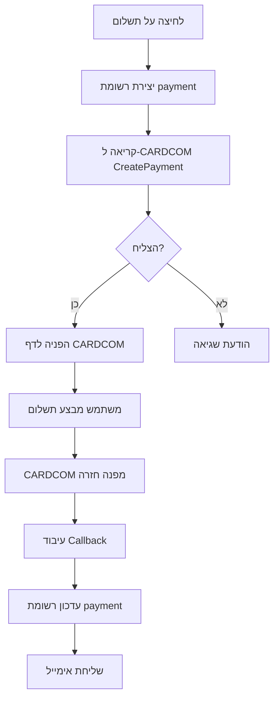
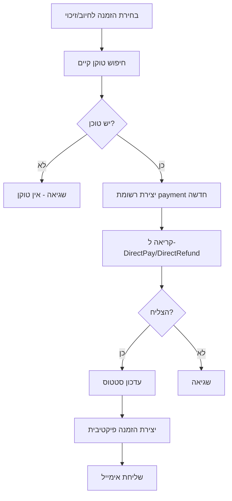

# מפרט טכני מפורט - CARDCOM API Integration

## פרטי API מהמערכת הישנה

### 1. **URLs ו-Endpoints**

```typescript
const CARDCOM_CONFIG = {
  BASE_URL: "https://secure.cardcom.solutions/api/v11",
  ENDPOINTS: {
    CREATE_PAYMENT: "/payments",
    DIRECT_CHARGE: "/directPay", 
    DIRECT_REFUND: "/directRefund"
  }
};
```

### 2. **פרמטרים מדויקים לכל קריאה**

#### **יצירת תשלום חדש (CreatePayment)**
```typescript
interface CreatePaymentRequest {
  // פרמטרי חובה
  TerminalNumber: string;     // מספר טרמינל
  UserName: string;          // שם משתמש
  APIKey: string;            // מפתח API
  
  // פרטי התשלום
  Operation: 1;              // תמיד 1 לחיוב
  Currency: 1;               // תמיד 1 לשקלים
  Sum: number;               // הסכום בשקלים
  Description: string;       // תיאור התשלום
  
  // פרמטרי זיהוי ובקרה
  ReturnValue: string;       // מזהה ייחודי שלנו (paymentID)
  CreateToken: true;         // תמיד true ליצירת טוקן
  
  // URLs להפניה
  SuccessRedirectUrl: string; // דף הצלחה
  ErrorRedirectUrl: string;   // דף שגיאה
  
  // פרטי לקוח (אופציונלי אבל מומלץ)
  CustomerName?: string;
  CustomerEmail?: string;
  CustomerPhone?: string;
}

// תגובה מצופה
interface CreatePaymentResponse {
  ResponseCode: "0" | string;  // "0" = הצלחה
  Description: string;         // תיאור התוצאה
  url?: string;               // URL להפניה אם הצליח
  LowProfileCode?: string;    // קוד לתשלום LowProfile
}
```

#### **חיוב ישיר (DirectPay)**
```typescript
interface DirectChargeRequest {
  // פרמטרי חובה
  TerminalNumber: string;
  UserName: string;
  APIKey: string;
  
  // פרטי התשלום
  Operation: 1;              // 1 = חיוב
  Currency: 1;               // שקלים
  Sum: number;               // סכום החיוב
  Description: string;       // תיאור
  
  // טוקן ומזהה
  Token: string;             // הטוקן השמור
  ReturnValue: string;       // מזהה ייחודי חדש
}

// תגובה מצופה
interface DirectChargeResponse {
  ResponseCode: "0" | string;
  Description: string;
  InternalDealNumber?: string;  // מספר עסקה פנימי
  TransactionID?: string;       // מזהה העברה
}
```

#### **זיכוי ישיר (DirectRefund)**
```typescript
interface DirectRefundRequest {
  // פרמטרי חובה
  TerminalNumber: string;
  UserName: string;
  APIKey: string;
  
  // פרטי הזיכוי
  Operation: 2;              // 2 = זיכוי
  Currency: 1;               // שקלים
  Sum: number;               // סכום הזיכוי
  Description: string;       // תיאור
  
  // טוקן ומזהה
  Token: string;             // הטוקן השמור
  ReturnValue: string;       // מזהה ייחודי חדש
}

// תגובה זהה לחיוב
interface DirectRefundResponse {
  ResponseCode: "0" | string;
  Description: string;
  InternalDealNumber?: string;
  TransactionID?: string;
}
```

### 3. **עיבוד Callbacks מ-CARDCOM**

#### **פרמטרים שמגיעים בהפניה חזרה:**
```typescript
interface CardcomCallback {
  // סטטוס התשלום
  complete?: "1" | "0";           // האם הושלם בהצלחה
  token?: "1" | "0";              // האם נוצר טוקן
  
  // פרטי התשלום
  sum?: string;                   // הסכום ששולם
  currency?: string;              // מטבע
  
  // מזהים
  ReturnValue?: string;           // המזהה שלנו
  InternalDealNumber?: string;    // מספר עסקה של CARDCOM
  
  // פרטי כרטיס (מוצפנים)
  last4?: string;                 // 4 ספרות אחרונות
  
  // טוקן נתונים (JSON מוצפן)
  tokenData?: string;             // JSON עם פרטי הטוקן
}
```

#### **מבנה tokenData לאחר פענוח:**
```typescript
interface TokenData {
  token: string;          // הטוקן עצמו
  last4: string;          // 4 ספרות אחרונות
  name: string;           // שם בעל הכרטיס
  phone: string;          // טלפון
  email: string;          // אימייל
  // ייתכנו שדות נוספים...
}
```

### 4. **מבנה בסיס הנתונים המדויק (MongoDB)**

#### **MongoDB Schema לתשלומים**
```typescript
// models/Payment.ts
import mongoose from 'mongoose';

const PaymentSchema = new mongoose.Schema({
  _id: { 
    type: String, 
    required: true,
    default: () => crypto.randomUUID()
  },
  order_id: { 
    type: String, 
    required: true,
    index: true
  },
  
  // סוג התשלום
  pay_type: { 
    type: String, 
    enum: ['ccard', 'refund', 'cash'], 
    default: 'ccard' 
  },
  sub_type: { 
    type: String, 
    enum: ['direct', 'token', 'manual'], 
    default: 'direct' 
  },
  
  // זמנים
  start_time: { 
    type: Date, 
    default: Date.now,
    index: true
  },
  end_time: { type: Date },
  
  // פרטי תשלום
  sum: { 
    type: Number, 
    required: true,
    min: 0
  },
  complete: { 
    type: Boolean, 
    default: false,
    index: true
  },
  has_token: { 
    type: Boolean, 
    default: false 
  },
  
  // מזהי CARDCOM
  transaction_id: { 
    type: String,
    index: true,
    sparse: true
  },
  
  // נתוני JSON
  input_data: { type: mongoose.Schema.Types.Mixed },
  result_data: { type: mongoose.Schema.Types.Mixed },
  
  // מטא-דטה
  created_at: { 
    type: Date, 
    default: Date.now,
    index: true
  },
  updated_at: { 
    type: Date, 
    default: Date.now 
  }
}, {
  timestamps: { updatedAt: 'updated_at' }
});

// אינדקסים מורכבים
PaymentSchema.index({ order_id: 1, created_at: -1 });
PaymentSchema.index({ complete: 1, has_token: 1 });

export const Payment = mongoose.model('Payment', PaymentSchema);
```

#### **עדכון MongoDB Schema להזמנות**
```typescript
// models/Order.ts
import mongoose from 'mongoose';

const OrderSchema = new mongoose.Schema({
  // שדות קיימים...
  
  // נתוני כרטיס אשראי (מוצפנים)
  cc_data: { type: mongoose.Schema.Types.Mixed },
  
  // סטטוס פיקטיבי (21=חיוב נוסף, 22=זיכוי)
  fictive_status: { 
    type: Number,
    enum: [21, 22],
    sparse: true
  }
});

export const Order = mongoose.model('Order', OrderSchema);
```

### 5. **זרימות עבודה מדויקות**

#### **זרימת תשלום ראשוני:**


#### **זרימת חיוב/זיכוי נוסף:**


### 6. **טיפול בשגיאות**

#### **קודי שגיאה נפוצים של CARDCOM:**
```typescript
const CARDCOM_ERROR_CODES = {
  "0": "הצלחה",
  "1": "שגיאה כללית",
  "2": "פרמטר חסר או שגוי",
  "3": "בעיה באימות",
  "4": "טוקן לא תקף",
  "5": "סכום לא תקף",
  "6": "מטבע לא נתמך",
  "7": "תקלה בתקשורת עם הבנק",
  // ... עוד קודים
};
```

#### **לוגיקת טיפול בשגיאות:**
```typescript
function handleCardcomResponse(response: any) {
  if (response.ResponseCode === "0") {
    // הצלחה
    return { success: true, data: response };
  } else {
    // שגיאה
    const errorMessage = CARDCOM_ERROR_CODES[response.ResponseCode] || 
                        response.Description || 
                        "שגיאה לא ידועה";
    
    // לוג השגיאה
    console.error("CARDCOM Error:", {
      code: response.ResponseCode,
      description: response.Description,
      timestamp: new Date().toISOString()
    });
    
    return { success: false, error: errorMessage };
  }
}
```

### 7. **אבטחה והצפנה**

#### **הצפנת נתונים רגישים:**
```typescript
// הצפנת tokenData לפני שמירה
function encryptTokenData(tokenData: TokenData): string {
  const crypto = require('crypto');
  const algorithm = 'aes-256-gcm';
  const key = process.env.ENCRYPTION_KEY; // 32 bytes key
  
  const iv = crypto.randomBytes(16);
  const cipher = crypto.createCipher(algorithm, key);
  cipher.setAAD(Buffer.from('cardcom-token'));
  
  let encrypted = cipher.update(JSON.stringify(tokenData), 'utf8', 'hex');
  encrypted += cipher.final('hex');
  
  const authTag = cipher.getAuthTag();
  
  return JSON.stringify({
    iv: iv.toString('hex'),
    data: encrypted,
    authTag: authTag.toString('hex')
  });
}
```

### 8. **Environment Variables נדרשים**

```env
# CARDCOM Configuration
CARDCOM_TERMINAL_NUMBER=your_terminal_number
CARDCOM_USERNAME=your_username  
CARDCOM_API_KEY=your_api_key
CARDCOM_BASE_URL=https://secure.cardcom.solutions/api/v11
CARDCOM_TEST_MODE=true

# Security
ENCRYPTION_KEY=your_32_byte_encryption_key
JWT_SECRET=your_jwt_secret

# URLs
NEXT_PUBLIC_BASE_URL=http://localhost:3000
PAYMENT_SUCCESS_URL=/payment/success
PAYMENT_ERROR_URL=/payment/error

# Email (for notifications)
EMAIL_SERVICE_API_KEY=your_email_service_key
```

### 9. **דוגמת יישום מלא**

#### **API Route ליצירת תשלום (MongoDB):**
```typescript
// app/api/payments/create/route.ts
import { NextRequest, NextResponse } from 'next/server';
import { Payment } from '@/models/Payment';
import { connectDB } from '@/lib/mongodb';
import crypto from 'crypto';

export async function POST(request: NextRequest) {
  try {
    await connectDB();
    
    const body = await request.json();
    const { orderId, amount, description, customerData } = body;
    
    // יצירת רשומת payment ב-MongoDB
    const paymentId = crypto.randomUUID();
    const payment = new Payment({
      _id: paymentId,
      order_id: orderId,
      sum: amount,
      pay_type: 'ccard',
      sub_type: 'token',
      input_data: body,
      start_time: new Date()
    });
    
    await payment.save();
    
    // קריאה ל-CARDCOM
    const cardcomResponse = await fetch(`${process.env.CARDCOM_BASE_URL}/payments`, {
      method: 'POST',
      headers: { 'Content-Type': 'application/json' },
      body: JSON.stringify({
        TerminalNumber: process.env.CARDCOM_TERMINAL_NUMBER,
        UserName: process.env.CARDCOM_USERNAME,
        APIKey: process.env.CARDCOM_API_KEY,
        Operation: 1,
        Currency: 1,
        Sum: amount,
        Description: description,
        ReturnValue: paymentId,
        CreateToken: true,
        SuccessRedirectUrl: `${process.env.NEXT_PUBLIC_BASE_URL}/payment/callback?status=success&paymentId=${paymentId}`,
        ErrorRedirectUrl: `${process.env.NEXT_PUBLIC_BASE_URL}/payment/callback?status=error&paymentId=${paymentId}`
      })
    });
    
    const result = await cardcomResponse.json();
    
    if (result.ResponseCode === "0") {
      return NextResponse.json({ 
        success: true, 
        paymentUrl: result.url,
        paymentId 
      });
    } else {
      // עדכון הרשומה עם השגיאה
      await Payment.findByIdAndUpdate(paymentId, {
        result_data: result,
        end_time: new Date()
      });
      throw new Error(result.Description);
    }
    
  } catch (error) {
    console.error('Payment creation error:', error);
    return NextResponse.json({ 
      success: false, 
      error: error instanceof Error ? error.message : 'Unknown error'
    }, { status: 500 });
  }
}
```

### 10. **רשימת בדיקות חובה**

- [ ] תשלום מוצלח עם יצירת טוקן
- [ ] תשלום נכשל עם הודעת שגיאה נכונה  
- [ ] חיוב נוסף עם טוקן קיים
- [ ] זיכוי עם טוקן קיים
- [ ] שמירת נתונים נכונה בבסיס הנתונים
- [ ] שליחת אימיילים אוטומטיים
- [ ] טיפול בשגיאות רשת
- [ ] הצפנה ופענוח של נתונים רגישים
- [ ] לוגים מפורטים ללא חשיפת נתונים רגישים
- [ ] עבודה במצב בדיקה (test mode)

**השתמש במסמך זה יחד עם ה-PROMPT הראשי כדי לקבל יישום מדויק ומלא!** 