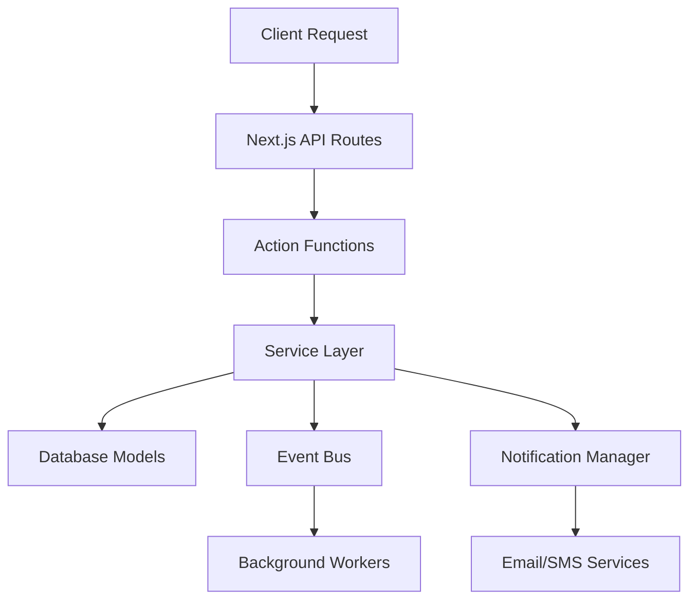

# Developer Guide: Booking Lifecycle Architecture

## Table of Contents
1. [Overview](#overview)
2. [System Architecture](#system-architecture)
3. [Core Components](#core-components)
4. [API Endpoints](#api-endpoints)
5. [Database Models](#database-models)
6. [Event System](#event-system)
7. [Notification System](#notification-system)
8. [State Management](#state-management)
9. [Testing](#testing)
10. [Deployment](#deployment)

## Overview

The booking lifecycle is the core business logic of the Masu platform, handling the complete flow from booking creation to review completion. The system is built with Next.js 14, TypeScript, MongoDB, and follows event-driven architecture patterns.

### Key Design Principles
- **Event-Driven**: Uses events for loose coupling between components
- **Type-Safe**: Full TypeScript coverage with strict typing
- **Scalable**: Modular architecture supporting horizontal scaling
- **Resilient**: Comprehensive error handling and fallback mechanisms

## System Architecture



### Core Flow
1. **Client Layer**: React components with form validation
2. **API Layer**: Next.js API routes with authentication
3. **Business Logic**: Server actions with validation schemas
4. **Service Layer**: Reusable services for complex operations
5. **Data Layer**: MongoDB with Mongoose ODM
6. **Event Layer**: Event-driven notifications and workflows
7. **Integration Layer**: External services (SMS, Email, Payment)

## Core Components

### 1. Booking Actions (`actions/booking-actions.ts`)

Main booking management functions:

```typescript
// Create new booking
export async function createBooking(data: BookingFormData): Promise<BookingResult>

// Professional accepts booking
export async function professionalAcceptBooking(bookingId: string): Promise<BookingResult>

// Professional marks en route
export async function professionalMarkEnRoute(bookingId: string): Promise<BookingResult>

// Professional marks completed
export async function professionalMarkCompleted(bookingId: string): Promise<BookingResult>

// Admin assigns professional
export async function assignProfessionalToBooking(
  bookingId: string, 
  professionalId: string
): Promise<BookingResult>
```

### 2. Professional Matching Service

```typescript
// lib/services/professional-matching-service.ts
export class ProfessionalMatchingService {
  static async findSuitableProfessionals(
    bookingId: string,
    options?: MatchingOptions
  ): Promise<ProfessionalMatchResult[]>

  static async calculateMatch(
    professional: IProfessionalProfile,
    criteria: MatchingCriteria
  ): Promise<ProfessionalMatchResult>
}
```

### 3. Notification System

```typescript
// lib/notifications/booking-notification-service.ts
export class BookingNotificationService {
  async sendBookingCreated(bookingId: string, userId: string): Promise<NotificationResult[]>
  async sendBookingConfirmation(bookingId: string, professionalId: string): Promise<NotificationResult[]>
  async sendBookingNotification(bookingId: string, professionalId: string): Promise<NotificationResult[]>
  async sendReviewRequest(bookingId: string, userId: string): Promise<NotificationResult[]>
}
```

### 4. Review Management

```typescript
// lib/services/automatic-review-service.ts
export class AutomaticReviewService {
  async triggerReviewRequestOnCompletion(bookingId: string): Promise<ServiceResult>
  async sendScheduledReviewReminders(): Promise<ReminderStats>
  async sendManualReviewRequest(bookingId: string, forceResend?: boolean): Promise<ServiceResult>
}
```

## API Endpoints

### Booking Management
```typescript
// API Routes Structure
/api/bookings/
├── create/                    # POST - Create new booking
├── [bookingId]/
│   ├── route.ts              # GET, PUT, DELETE - Basic CRUD
│   ├── assign/               # POST - Assign professional
│   ├── status/               # PUT - Update status
│   └── professional-responses/ # GET - Get professional responses

/api/admin/bookings/
├── route.ts                  # GET - List all bookings with filters
├── [bookingId]/
│   ├── assign/               # POST - Admin assign professional
│   ├── unassign/             # POST - Remove professional assignment
│   └── professional-responses/ # GET - Admin view responses

/api/professional/
├── bookings/                 # GET - Professional's bookings
├── accept/                   # POST - Accept booking
├── decline/                  # POST - Decline booking
├── mark-enroute/             # POST - Mark en route
└── mark-completed/           # POST - Mark completed
```

### Request/Response Examples

#### Create Booking
```typescript
POST /api/bookings/create
{
  "treatmentId": "64f...",
  "bookingDateTime": "2024-01-15T14:00:00Z",
  "recipientName": "John Doe",
  "recipientPhone": "+972501234567",
  "address": {
    "street": "Dizengoff 1",
    "city": "Tel Aviv",
    "building": "5",
    "apartment": "10"
  },
  "therapistGenderPreference": "any",
  "notes": "Second floor, ring twice"
}

Response:
{
  "success": true,
  "booking": {
    "_id": "64f...",
    "bookingNumber": "MASU-2024-001234",
    "status": "pending_professional",
    "createdAt": "2024-01-15T12:00:00Z"
  }
}
```

#### Professional Accept Booking
```typescript
POST /api/professional/accept
{
  "bookingId": "64f...",
  "estimatedArrivalTime": "2024-01-15T13:45:00Z",
  "notes": "On my way, will arrive shortly"
}

Response:
{
  "success": true,
  "message": "Booking accepted successfully",
  "booking": {
    "_id": "64f...",
    "status": "confirmed",
    "professionalId": "64f...",
    "confirmedAt": "2024-01-15T12:05:00Z"
  }
}
```

## Database Models

### Booking Model
```typescript
// lib/db/models/booking.ts
interface IBooking {
  _id: ObjectId
  bookingNumber: string
  userId: ObjectId
  professionalId?: ObjectId
  treatmentId: ObjectId
  
  // Status and timing
  status: BookingStatus
  bookingDateTime: Date
  createdAt: Date
  confirmedAt?: Date
  treatmentCompletedAt?: Date
  
  // Recipient details
  recipientName: string
  recipientPhone: string
  recipientEmail?: string
  recipientGender?: "male" | "female"
  
  // Address
  bookingAddressSnapshot: {
    fullAddress: string
    street: string
    city: string
    building?: string
    apartment?: string
    floor?: string
    coordinates?: [number, number]
  }
  
  // Professional matching
  suitableProfessionals?: Array<{
    professionalId: ObjectId
    matchScore: number
    notifiedAt?: Date
  }>
  
  // Pricing
  priceDetails: {
    basePrice: number
    finalAmount: number
    totalProfessionalPayment: number
    companyFee: number
    discount?: number
  }
  
  // Review system
  reviewRequestSentAt?: Date
  firstReminderSentAt?: Date
  secondReminderSentAt?: Date
  finalReminderSentAt?: Date
  
  // Preferences and settings
  therapistGenderPreference?: "male" | "female" | "any"
  isFlexibleTime?: boolean
  flexibilityRangeHours?: number
  
  // Additional fields
  notes?: string
  adminNotes?: string
  cancelReason?: string
  cancelledAt?: Date
}

type BookingStatus = 
  | "pending_professional"
  | "confirmed" 
  | "on_way"
  | "completed"
  | "pending_review"
  | "reviewed"
  | "cancelled"
  | "no_professionals_available"
```

### Professional Response Model
```typescript
// lib/db/models/professional-response.ts
interface IProfessionalResponse {
  _id: ObjectId
  bookingId: ObjectId
  professionalId: ObjectId
  
  // Response details
  status: "pending" | "accepted" | "declined" | "expired"
  sentAt: Date
  respondedAt?: Date
  responseMethod?: "sms" | "app" | "phone"
  
  // Communication
  phoneNumber: string
  smsMessageId?: string
  emailMessageId?: string
  
  // Response data
  notes?: string
  declineReason?: string
  estimatedArrivalTime?: Date
  
  // Tracking
  createdAt: Date
  updatedAt: Date
}
```

## Event System

### Event Types
```typescript
// lib/events/booking-event-system.ts
type BookingEventType = 
  | "booking:created"
  | "booking:professional_assigned"
  | "booking:professional_confirmed"
  | "booking:professional_declined"
  | "booking:status_updated"
  | "booking:completed"
  | "booking:cancelled"
  | "booking:review_requested"

interface BookingEvent {
  type: BookingEventType
  bookingId: string
  userId?: string
  professionalId?: string
  timestamp: Date
  metadata?: Record<string, any>
}
```

### Event Handlers
```typescript
// lib/events/handlers/booking-handlers.ts
export const bookingHandlers = {
  "booking:created": async (event: BookingEvent) => {
    // Find suitable professionals
    // Send notifications
    // Log creation
  },
  
  "booking:completed": async (event: BookingEvent) => {
    // Trigger review request
    // Update professional stats
    // Process payment
  },
  
  "booking:professional_confirmed": async (event: BookingEvent) => {
    // Notify client
    // Cancel other pending responses
    // Update booking status
  }
}
```

## Notification System

### Notification Manager
```typescript
// lib/notifications/notification-manager.ts
export class NotificationManager {
  async sendNotification(
    recipient: NotificationRecipient,
    data: NotificationData
  ): Promise<NotificationResult>

  async sendNotificationToMultiple(
    recipients: NotificationRecipient[],
    data: NotificationData
  ): Promise<NotificationResult[]>

  async sendOTP(
    recipient: EmailRecipient | PhoneRecipient,
    length?: number,
    expiryMinutes?: number
  ): Promise<{ code: string; expiryDate: Date; result: NotificationResult }>
}
```

### Email Templates
```typescript
// lib/notifications/templates/email-templates.ts
export const emailTemplates = {
  bookingCreated: (data: BookingData) => ({
    subject: `אישור הזמנה ${data.bookingNumber}`,
    html: renderBookingCreatedTemplate(data),
    text: generatePlainTextVersion(data)
  }),
  
  professionalNotification: (data: ProfessionalNotificationData) => ({
    subject: `הזמנה חדשה - ${data.treatmentName}`,
    html: renderProfessionalNotificationTemplate(data),
    text: generatePlainTextVersion(data)
  })
}
```

### SMS Templates
```typescript
// lib/notifications/templates/sms-templates.ts
export const smsTemplates = {
  bookingCreated: (data: BookingData) => 
    `הזמנתך ${data.bookingNumber} נקלטה במערכת. נחפש מטפל מתאים ונעדכן אותך בקרוב.`,
    
  professionalNotification: (data: ProfessionalNotificationData) =>
    `הזמנה חדשה: ${data.treatmentName} ב-${data.address}. לקבלה/דחייה: ${data.responseUrl}`
}
```

## State Management

### Client State (React Query)
```typescript
// hooks/use-booking-data.ts
export function useBookingData(bookingId: string) {
  return useQuery({
    queryKey: ["booking", bookingId],
    queryFn: () => getBookingDetails(bookingId),
    refetchInterval: 30000, // Real-time updates
    enabled: !!bookingId
  })
}

export function useBookingMutations() {
  const queryClient = useQueryClient()
  
  const acceptBooking = useMutation({
    mutationFn: professionalAcceptBooking,
    onSuccess: () => {
      queryClient.invalidateQueries({ queryKey: ["bookings"] })
    }
  })
  
  return { acceptBooking }
}
```

### Server State (Actions)
```typescript
// State transitions handled by server actions
export async function updateBookingStatus(
  bookingId: string,
  newStatus: BookingStatus,
  metadata?: Record<string, any>
): Promise<BookingResult> {
  // Validate status transition
  // Update database
  // Trigger events
  // Send notifications
  // Return updated booking
}
```

## Testing

### Unit Tests
```typescript
// __tests__/services/professional-matching.test.ts
describe("ProfessionalMatchingService", () => {
  test("should find suitable professionals", async () => {
    const booking = await createTestBooking()
    const professionals = await ProfessionalMatchingService.findSuitableProfessionals(
      booking._id.toString()
    )
    
    expect(professionals).toHaveLength(2)
    expect(professionals[0].matchScore).toBeGreaterThan(0.8)
  })
  
  test("should calculate match score correctly", async () => {
    const professional = createTestProfessional()
    const criteria = createTestCriteria()
    
    const result = await ProfessionalMatchingService.calculateMatch(
      professional,
      criteria
    )
    
    expect(result.canMatch).toBe(true)
    expect(result.matchScore).toBeGreaterThan(0.5)
  })
})
```

### Integration Tests
```typescript
// __tests__/integration/booking-flow.test.ts
describe("Complete Booking Flow", () => {
  test("should complete full booking lifecycle", async () => {
    // 1. Create booking
    const booking = await createBooking(testBookingData)
    expect(booking.status).toBe("pending_professional")
    
    // 2. Find professionals
    const professionals = await findSuitableProfessionals(booking._id)
    expect(professionals).toHaveLength(1)
    
    // 3. Accept booking
    const acceptResult = await professionalAcceptBooking(booking._id)
    expect(acceptResult.success).toBe(true)
    
    // 4. Mark completed
    const completeResult = await professionalMarkCompleted(booking._id)
    expect(completeResult.success).toBe(true)
    
    // 5. Verify review request sent
    const updatedBooking = await getBookingDetails(booking._id)
    expect(updatedBooking.status).toBe("pending_review")
    expect(updatedBooking.reviewRequestSentAt).toBeDefined()
  })
})
```

### E2E Tests (Playwright)
```typescript
// e2e/booking-flow.spec.ts
test("Complete booking flow from client perspective", async ({ page }) => {
  // Navigate to booking page
  await page.goto("/our-treatments/massage/swedish-massage")
  
  // Fill booking form
  await page.fill('[data-testid="recipient-name"]', "John Doe")
  await page.fill('[data-testid="phone"]', "0501234567")
  await page.selectOption('[data-testid="date"]', "2024-01-15")
  
  // Submit booking
  await page.click('[data-testid="submit-booking"]')
  
  // Verify confirmation
  await expect(page.locator('[data-testid="booking-confirmation"]')).toBeVisible()
  
  // Check booking appears in dashboard
  await page.goto("/dashboard/member/bookings")
  await expect(page.locator('[data-testid="booking-card"]')).toBeVisible()
})
```

## Deployment

### Environment Variables
```bash
# Database
MONGODB_URI=mongodb+srv://...
MONGODB_DB_NAME=masu_production

# Authentication
NEXTAUTH_SECRET=...
NEXTAUTH_URL=https://app.masu.co.il

# External Services
EMAIL_API_KEY=...
SMS_API_KEY=...
PAYMENT_API_KEY=...

# Feature Flags
ENABLE_AUTOMATIC_REVIEWS=true
ENABLE_PROFESSIONAL_NOTIFICATIONS=true
MAX_PROFESSIONAL_RESPONSES=5
```

### Docker Configuration
```dockerfile
# Dockerfile
FROM node:18-alpine AS base

WORKDIR /app
COPY package*.json ./
RUN npm ci --only=production

COPY . .
RUN npm run build

EXPOSE 3000
CMD ["npm", "start"]
```

### Monitoring
```typescript
// lib/monitoring/booking-metrics.ts
export class BookingMetrics {
  static async trackBookingCreated(bookingId: string) {
    await metrics.increment("booking.created")
    await metrics.timing("booking.creation_time", Date.now())
  }
  
  static async trackProfessionalResponse(responseTime: number) {
    await metrics.timing("professional.response_time", responseTime)
  }
  
  static async trackBookingCompletion(bookingId: string) {
    await metrics.increment("booking.completed")
  }
}
```

---

## Best Practices

1. **Always use TypeScript**: Ensure type safety across all components
2. **Event-driven architecture**: Use events for decoupling components
3. **Comprehensive error handling**: Every function should handle errors gracefully
4. **Real-time updates**: Use React Query for automatic data synchronization
5. **Testing**: Maintain high test coverage, especially for critical booking flows
6. **Monitoring**: Track key metrics and set up alerts for failures
7. **Documentation**: Keep docs updated with code changes

## Contributing

1. Follow the existing code patterns and naming conventions
2. Add tests for new features
3. Update documentation when adding new APIs
4. Use semantic commit messages
5. Test booking flows end-to-end before deploying

---

For technical support, contact the development team or check the internal wiki for additional implementation details. 